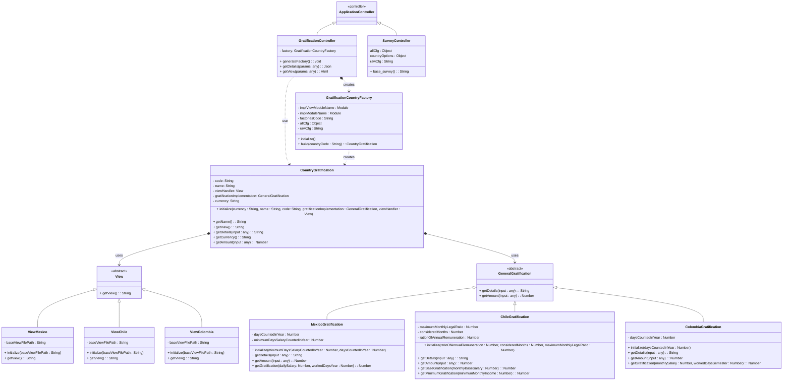
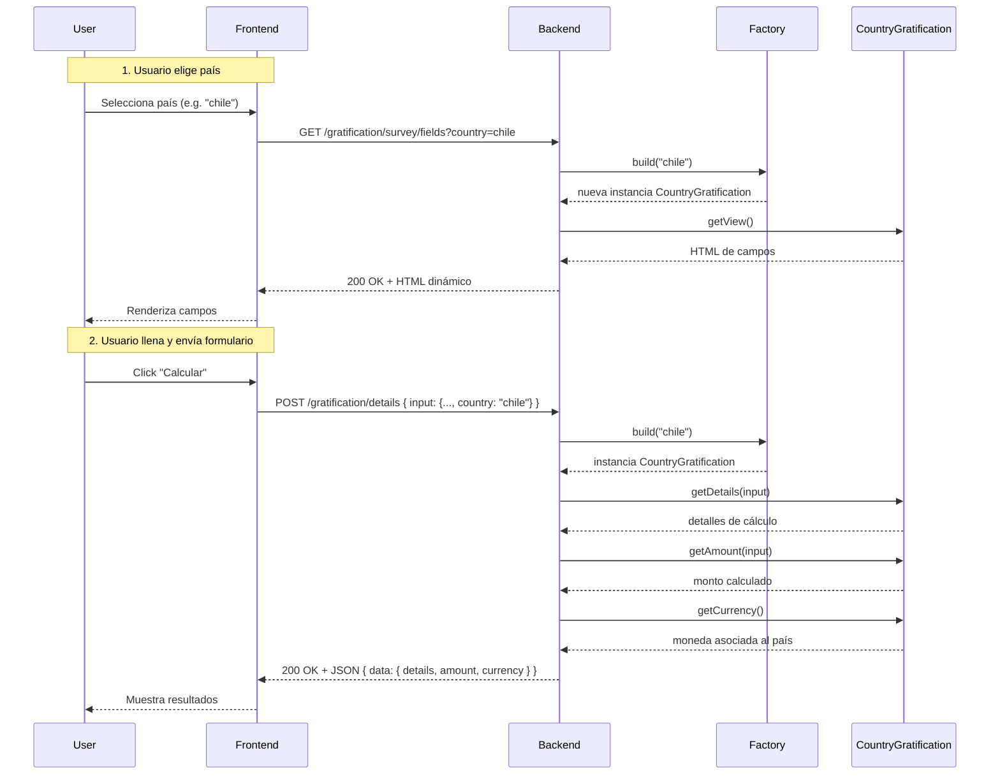

# README LegalGratification Test Buk

---

## Tabla de Contenidos

- [Prerrequisitos](#prerrequisitos) 
- [Descripción](#descripcion)  
- [Requerimientos](#requerimientos)  
- [Diseño y Arquitectura](#diseno-y-arquitectura)  
- [Implementación](#implementacion)  
- [Instalación](#instalacion)  
- [Configuración](#configuracion)  
- [Configuración Específica de la Aplicación](#configuracion-especifica)  
- [Uso local](#uso-local)  
- [Despliegue en Render](#despliegue-render)  
- [Anexo](#anexo)  


---

## Prerrequisitos <a name="prerrequisitos"></a>

[](https://www.ruby-lang.org/)  
[](https://rubyonrails.org/)  
[](https://www.docker.com/)  
[](https://nodejs.org/)

## Descripción <a name="descripcion"></a>

`LegalGratification` es una aplicación Rails que genera **formularios dinámicos** y **cálculos de gratificaciones** adaptados al país seleccionado. Emplea los principios SOLID, el patrón **Strategy** para desacoplar vistas y cálculos. Además utiliza el método **Simple Factory** basado en reflexión para instanciar la estrategia correcta según un archivo JSON de configuración. Esta se realiza específicamente para el test técnico de BUK.

## Requerimientos: <a name="requerimientos"></a>

1. Crear un formulario dinámico, el cual debe cambiar según el país escogido.
2. Crear un método de cáclculo dinámico, cuyo resultado y cálculo debe cambiar dinámicamente según el país escogido.

## Diseño y Arquitectura <a name="diseno-y-arquitectura"></a>

- Se aplican en forma general los principios **SOLID** e **inyección de dependencias**. 
- Se utiliza el patrón **Strategy** para cambiar las vistas (`View`) y las lógica de gratificación (`GeneralGratification`) en tiempo de ejecución.  
- Se aplica un **Simple Factory** (`GratificationCountryFactory`) con reflexión para leer `config/factories.json` y crear instancias de forma dinámica.

* El Modelo UML de las clases principales se muestra en el siguiente diagrama mermaid embebido:



* Por otro lado el diagrama de secuencia conceptual se muestra en el siguiente diagrama mermaid embebido:



## Implementación <a name="implementacion"></a>

- En este modelo se utiliza la clase `CountryGratification` para instanciar objetos de tipo "País", esta clase se encarga de instanciar datos cuya estructura es comun para cada país, como por ejemplo la moneda y el nombre.

- Se cuenta con la clase `GraficationCountryFactory` la cual aplica el método factory para instanciar en tiempo de ejecución un país específico, además se encarga de inyectar las dependencias necesarias para la creación del país. Para realizar esto se lee el archivo `buk-gratification-survey-test/config/factories.json`, Todo esto en base al "código de país" recibido como input en la función `build`.

- Se cuenta con la clase abstracta `View` la cual se utiliza como intermediario entre la clase `CountryGratification` y las clases que implementan las vistas, esto mediante el método `getView`.

- Se cuenta con la clase abstracta `GeneralGratification` cuyo objetivo es actuar como intermediaria entre la clase `CountryGratification` y las clases que implementan las gratificationes, esto mediante los métodos `getDetails(input)` y `getAmount(input)`.

- Se cuentan con las clases `ViewChile`, `ViewColombia` y `ViewMexico` las cuales implementan la clase `View` y se encargan de interactuar con las vistas específicas de "inputs" de cada país.

- Se cuentan con las clases `ChileGratification`, `ColombiaGratification` y `MexicoGratification` las cuales implementan la clase `GeneralGratification` y se encargan de realizar los cálculos y desgloses respectivos para cada páís.

- Se cuenta con la clase `SurveyController`, la cual hereda de la clase `ApplicationController`. Esta recibe requerimmientos provenientes desde el endpoint  `survey` y se encarga de renderizar la primera vista al formulario mediante el método `base_survey`.

- Se cuenta con la clase `GratificationController` la cual hereda de la clase `ApplicationController`. Esta se encarga de procesar requerimientos provenientes de los endpoints `gratification/survey/field` y `gratification/details`, los cuales entregan la vista de los campos  de entrada asociados a un país y procesan las gratificaciones respectivamente mediante los métodos `getView` y `getDetails`.

- Se tienen las siguientes rutas:
    - `survey`: Este endpoint de tipo get se usa para obtener la primera vista del formulario. Se configura además esta ruta como la url raíz.
    - `gratification/survey/fields`: Este endpoint de tipo get se utiliza para obtener los campos asociados a un país especifico, en base al query parameter `country` el cual contiene un código asociado a un país, consistente con el archivo `factories.json`.
    - `gratification/details` : Este endpoint de tipo post se utiliza para realizar los cálculos de gratificaciones para cada país, en su cuerpo recibe un objeto JSON con las entradas ingresadas por el usuario (más el código de país ingresado en primera instancia) y retorna también un objeto JSON con el desglose del cáculo. Por ejemplo una llamada de red de este tipo tendría la siguiente forma.

```bash
curl --location 'http://localhost:3000/gratification/details' \
--header 'Accept: application/json' \
--header 'Content-Type: application/json' \
--header 'X-CSRF-Token: {{X-CSRF-Token}}' \
--data '{"input":{"monthly_base_salary":"2000000","minimum_monthly_income":"2000","country":"chile"}}'
```

- La implemetación de las rutas se ve de la siguiente forma:

```ruby
Rails.application.routes.draw do
  root to: 'survey#base_survey'
  get "survey" => "survey#base_survey", as: :base_survey
  get "gratification/survey/fields" => "gratification#getView", as: :survey_gratification
  post "gratification/details" => "gratification#getDetails", as: :calculate_gratification
end
```
- Por otro lado se implementaron vistas en archivos .html.erb para cada país, las cuales son referenciadas por cada implementación de la clase `View`. Estas tienen la siguiente estructura (se utilizó como ejemplo la de México):

```html
  <div class="form-group" data-dynamic-field="true">
    <label for="daily_salary_label">Salario diario</label>
    <input type="number" class="form-control" id="daily_salary" name="daily_salary" data-dynamic-input="true">
  </div>
  <div class="form-group" data-dynamic-field="true">
    <label for="worked_days_year_label">Días trabajados en el año</label>
    <input type="number" class="form-control" id="worked_days_year" name="worked_days_year" data-dynamic-input="true">
  </div>
```

- Donde para que las vistas funcionen se debe cumplir:
    - Cada elemento de clase `form-group` debe tener lo siguiente `data-dynamic-field="true"`.
    - Cada elemento de clase `form-control` debe tener un id único que no se debe repetir en ninguna otra vista y debe tener lo siguiente `data-dynamic-input="true"`.

- Además se implemento una vista de nombre `base_survey.html.erb`, la cual correponde a la vista "raíz" del formulario. Esta vista se encarga de recbir los campos dinámicamente de cada país según lo que el usuario selecciona en primera instancia, esto mediante el endpoint `gratification/survey/fields`. También se encarga de realizar llamadas de red al endpoint de procesamiento `gratification/details`, cuando se presiona el botón "Calcular". Además se encarga de realizar validaciones de datos. El código de esta sección es relativamente simple y esta asociado a la visualización del formulario.

## Instalación <a name="instalacion"></a>

1. **Clonar el repositorio**  
```bash
git clone https://github.com/tu-org/LegalGratification.git
cd buk-gratification-survey-test
```
2. **Instalar dependencias Ruby**   
```bash
bundle install
```

## Configuración <a name="configuracion"></a>

1. Ejecutar el comando 
```bash
rails secret
```
y copiar la clave generada.

2. Crear una variable de entorno de nombre ``SECRET_KEY_BASE`` en el archivo .env y copiar el valor de la clave generada en el paso anterior (SECRET_KEY_BASE=tu_secret_key_generada_con_rails_secret).

3. Ejecutar comandos de base de datos (en esta implementación no se utiliza, pero igual es necesario configurarla).

```bash
rails db:create
rails db:migrate
```

## Configuración Específica de la Aplicación <a name="configuracion-especifica"></a>

1. Se deben tener creadas las vistas (activas) que se van a usar en cada país, estas vistas están presentes en el directorio buk-gratification-survey-test/app/views/survey. De forma inicial se tienen creadas vistas para Chile, Colombia y México.

2. Se deben tener creadas las implementaciones (activas) de las gratificaciones en el directorio buk-gratification-survey-test/app/classes/gratification_implementations. De forma inicial se tienen creadas implementaciones de gratificaciones para Chile, Colombia y México. Estas están asociadas a vistas específicas.

3. Para configurar este programa se debe tener creado el archvo ``factories.json`` de configuración en la ruta buk-gratification-survey-test/config/factories.json. Este debe tener la siguiente estructura:

```json
{
    "chile": {
        "currency": "CLP",
        "name": "Chile",
        "code": "chile",
        "factories": [
            {
                "name": "chile_gratification_v_1",
                "injects": {
                    "implementation_class": "ChileGratification",
                    "implementation_inputs": {},
                    "view_class": "ViewChile",
                    "view_inputs": {}
                },
                "version": 1,
                "isActive": true
            }
        ]
    },
    "colombia": {
        "currency": "COP",
        "name": "Colombia",
        "code": "colombia",
        "factories": [
            {
                "name": "colombia_gratification_v_1",
                "injects": {
                    "implementation_class": "ColombiaGratification",
                    "implementation_inputs": {},
                    "view_class": "ViewColombia",
                    "view_inputs": {}
                },
                "version": 1,
                "isActive": true
            }
        ]
    },
    "mexico": {
        "currency": "MXN",
        "name": "México",
        "code": "mexico",
        "factories": [
            {
                "name": "mexico_gratification_v_1",
                "injects": {
                    "implementation_class": "MexicoGratification",
                    "implementation_inputs": {},
                    "view_class": "ViewMexico",
                    "view_inputs": {}
                },
                "version": 1,
                "isActive": true
            }
        ]
    }
}
```

4. En el archivo buk-gratification-survey-test/config/factories.json deben estar presentes las configuraciones de las gratificaciones de cada país.
    - En este archivo la llave raíz representa al código estándar que va a tener un país.
    - En los objetos de cada país se van a tener los elementos:
        - currency: código de la moneda.
        - name: nombre visible del país.
        - code: código del país.
        - factories: corresponde a un arreglo de todas las posibles configuraciones de implementación para cada país. Únicamente una configuración puede estar activa en un momento determinado. Los campos que pueden tener son los siguientes:
            - name: nombre de la configuración de implementación.
            - version: version de la configuración.
            - isActive: indica si está activa o no la configuración.
            - injects: Contiene las clases y las entradas de las dependencias de implementación. Los campos que contiene injects son:
                - implementation_class: nombre de la clase que implementa las funciones de gratificación.
                - implementation_inputs: contiene las entradas que se le agregan a la clase que implementa las funciones de gratificación, cuando esta se instancia (como diccionario).
                - view_class: nombre de la clase que maneja la interacción con la vista del país.
                - view_inputs: contiene las entradas que se le agregan a la clase que maneja la interacción con la vista del país, cuando esta se instancia (como diccionario).

## Uso local <a name="uso-local"></a>

### Mediante Comando Rails

1. Para ejecutar en forma local este archivo se puede realizar lo siguiente:

```bash
rails server
```

2. Posteriormente para acceder a la aplicación mediante se debe ingresar al enlace ``http://localhost:3000``.

3. Para finalizar la ejecución del programa se debe ingresar CTRL+C en la terminal en la cual se ejecuta el proceso.

### Mediante Dockers 

1. Se debe crear la imagen (en base al archivo Dockerfile), ejecutando el siguiente comando en la raiz del programa mediante la terminal:

```bash
docker build -t legal-gratification .
```

2. Posteriormente se debe ejecutar un contenedor en base a la imagen creada anteriormente (utlizado el ambiente development y la llave generada con el comando rails secret).

```bash
docker run --name test-legal-gratification-container -p 3000:80 -e SECRET_KEY_BASE={{tu_secret_key}} -e RAILS_ENV=development -d legal-gratification
```

3. Luego para acceder a la aplicación se debe acceder al enlace ``http://localhost:3000``

4. Para finalizar el proceso se debe utilizar el siguiente comando en la terminal:

```bash
docker stop test-legal-gratification-container
```

## Despliegue en Render <a name="despliegue-render"></a>

1. Para desplegar la app se debe crear un nuevo Web Service utilizando una cuenta de Render, vinculando este repositorio de GitHub.

2. Se debe añadir `SECRET_KEY_BASE=tu_clave_generada` como variable de entorno.

3. Una vez revisada la configuración, se debe seleccionar la opción deploy, lo cual va a finalmente desplegar la aplicación.

* actualmente la aplicación fue desplegada con este método y se encuentra en el siguiente enlace (al ser un despliegue gratuito y de ejemplo puede que no funcione muy bien o en ciertos momentos se caiga):

[https://buk-gratification-survey-test.onrender.com/](https://buk-gratification-survey-test.onrender.com/)

## Anexo <a name="anexo"></a>

- También puede ver una documentación realizada mediante Deepwiki en el enlace [https://deepwiki.com/criszzz97/buk-gratification-survey-test/](https://deepwiki.com/criszzz97/buk-gratification-survey-test/)


